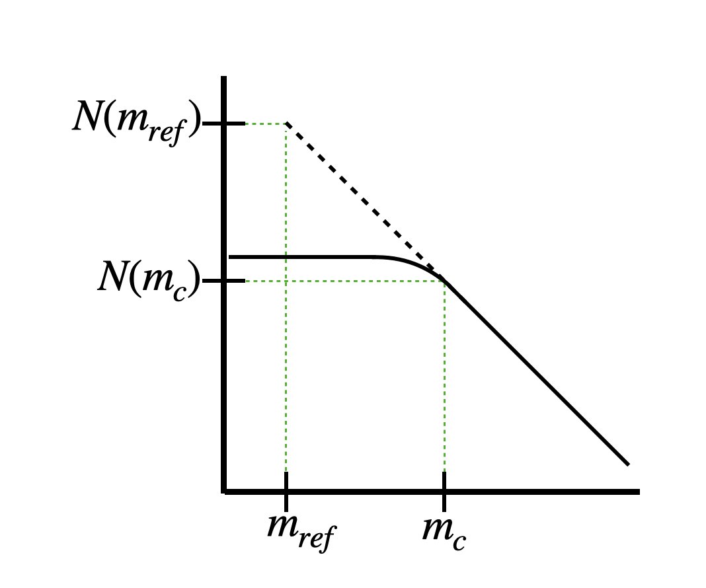

# Estimate a-value

The a-value is the parameter in the Gutenberg-Richter law that contains the information on the rate of seismicity within the volume and time interval of interest. Here, we will shortly explain the way to estimate the a-value, how to scale it correctly such that it can be compared accross catalogs, and eslpain the different methods available.

## 1. Basic a-value estimation

The GR-law above the completeness magnitude $m_c$ can be expressed as follows:

$$
N(m) = 10^{a - b (m - m_c)},
$$

where $N(m)$ is the number of events with magnitude larger than or equal to $m$ that occurred in the catalog. With this definition of the a-value, we can estimate the a-value just as the logarithm of the number of the earthquakes above completeness:

$$
a = \log N(m_c).  \tag{1}
$$

### 1.1 basic way to estimate: use the estimate_a function
In order to estimate the a-value with eq. (1), one needs only to know the magnitude of completeness and the discretization of the magnitudes, $\Delta m$:

```python
>>> from seismostats.analysis import estimate_a
>>> magnitudes = [0, 0, 1, 1, 1, 2, 3, 2, 3, 5, 6, 7]
>>> estimate_a(magnitudes, mc=1, delta_m=1)
np.float64(1)
```

Note that the function `estimate_a` cuts automatically off magnitudes below $m_c$, and does not count them. This is true for all a-value functionalities. Therefore, it is of crucial importance to provide the correct $m_c$.


## 4. Scaling and reference magnitude

There are however, two commonnly used modifications of the function above, which are relevanbt if we want to compare different a-values to each other.

First, it might be that the level of completeness is not constant. Therefore, it is often a convention to instead estimate the a-value with respect to a certain reference magnitude, such that the $10^{a_{m_{ref}}} = N(m_{ref})$. Here, $N(m_{ref})$ is not the actual nuber of earthquakes above $m_{ref}$, but the extrapolated number if the GR-law was perfectly valid above and below $m_c$, as shown in the sketch below. Eq. (1) changes effectively to $a_{m_{ref}} = a - b(m_{ref} - m_c)$.


/help


Second, one might want to compare time intervals of different length, but be interested in the earthquake rate. In this case, it is custom to estimate the a-value with respect to a reference time interval, which is often taken to be one year. We've included this funcionality by introducing a scaling factor. The scaling 

## 2. Basic a-value estimation


## 3. Different a-value estimators

## 4. Scaling and reference magnitude
